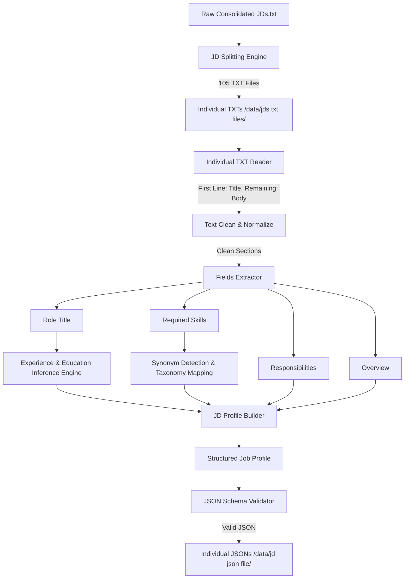

# Job Description Parsing Engine

The Job Description (JD) Parsing Engine is a modular, rule-based text processing module designed to clean, split, normalize, and validate job descriptions. It translates unstructured text documents into validated JSON files matching the `schemas/jd_schema.json` specification.

These structured job profiles are designed to integrate with the matching logic of the Applicant Tracking System (`ats_engine`) and resume screening services (`screening_ai`).

---

## Logical Architecture



---

## Key Features

### 1. Two-Step Pipeline Workflow
The pipeline processes job descriptions in two distinct sequential steps:
1. **Splitting Step**: Scans consolidated `.txt` files in `data/jds/`, splits the job descriptions based on numeric patterns (e.g. `1. Electronics Engineer (Trainee)`), and generates individual `.txt` files under `data/jds txt files/` named as `[index]_[slugified_title].txt`. The first line contains the job title and the remaining lines contain the raw JD content body.
2. **Parsing & Validation Step**: Reads each individual `.txt` file from `data/jds txt files/`, extracts the title and body, normalizes sections, standardizes skills, infers schema-required fields, validates the profile, and writes a schema-compliant JSON file under `data/jd json file/` named as `[index]_[slugified_title].json`.

### 2. Text Normalization and Cleaning
Prior to parsing, the text bodies are normalized:
- Invisible formatting characters and zero-width spaces are removed.
- Bullet points (including `•`, `*`, `◦`, `▪`) are standardized to `-`.
- Duplicated empty lines are collapsed, and redundant whitespace is cleaned.

### 3. Seniority, Experience, and Education Inference
Since template JDs do not specify years of experience or degree requirements, the engine programmatically infers them:
- **Experience Inference**:
  - `Trainee`, `GET`, `Fresh`, `Graduate`, `Intern`, `Apprentice` $\rightarrow$ `0-1` years (Beginner)
  - `Junior`, `Jr.`, `Associate` $\rightarrow$ `1-3` years (Beginner)
  - `Senior`, `Sr.` $\rightarrow$ `5-8` years (Advanced)
  - `Lead`, `Principal`, `Architect`, `Manager`, `Head` $\rightarrow$ `8-12` years (Expert)
  - Default $\rightarrow$ `2-5` years (Intermediate)
- **Education Inference**:
  - `Research / Quantum / Neuromorphic / Scientist` $\rightarrow$ Master's or Ph.D. in Physics/Electronics Engineering
  - `Trainee / GET` $\rightarrow$ Bachelor's degree (B.E./B.Tech.) in Electronics & Communication or Electrical Engineering
  - Default $\rightarrow$ Bachelor's degree in Electronics Engineering, Computer Science, or related field

### 4. Skill Synonym Mapping & Taxonomy Standardization
Raw skill bullet points are matched against a predefined taxonomy mapping (`STANDARD_SKILL_TAXONOMY`) covering PCB Design, Embedded C/C++, Microcontrollers, Analog & Digital Electronics, Hardware Testing, IoT, VLSI & IC Design, FPGA, MATLAB, Control Systems, Industrial Automation, Robotics, DSP, SMT, Semiconductors, Power & EV Electronics, Edge AI, and Space/Quantum systems.

*Note: Pure alphanumeric keywords use word boundary checks (`\b`) to prevent false substrings (e.g., preventing the word "basic" from matching "asic"). Unique custom skills not found in the taxonomy are cleaned and preserved in their original casing.*

### 5. Preferred Skills Extraction
The parser scans required skill text for parentheses containing indicators like `"preferred"`, `"optional"`, or `"nice to have"`. For example:
- `PCB design software (Altium, KiCad, Eagle - preferred)` splits into:
  - **Mandatory Skill**: `PCB Design`
  - **Preferred Skills**: `Altium Designer`, `KiCad`, `Eagle` (resolved through taxonomy mapping)

---

## Execution Guide

### Running the Refactored Pipeline
To execute the two-step split-and-parse pipeline:
```powershell
.venv\Scripts\python run_jd_pipeline.py
```
This script populates:
- `data/jds txt files/` with individual job descriptions in text format.
- `data/jd json file/` with validated structured JSON files.

### Running Unit Tests
To verify all parser steps, synonyms, boundaries, and validation:
```powershell
.venv\Scripts\pytest tests/test_jd_parser.py
```

---

## Input vs. Output Sample

### Raw Individual TXT File Example (`data/jds txt files/2_junior_electronics_engineer.txt`)
```text
Junior Electronics Engineer

Job Overview
Handles basic design, testing, and maintenance tasks in electronics projects.
Responsibilities
• Assist in PCB design and circuit debugging
• Perform hardware testing and validation
Skills Required
• Analog & digital electronics basics
• PCB design knowledge (Altium/Eagle preferred)
• Basic testing tools (multimeter, oscilloscope)
```

### Structured Schema-Compliant JSON Output (`data/jd json file/2_junior_electronics_engineer.json`)
```json
{
  "job_title": "Junior Electronics Engineer",
  "company_info": {
    "name": "Generic Electronics Corporation",
    "industry": "Semiconductors & Electronics Manufacturing",
    "description": "A pioneering engineering firm specializing in advanced electronic design and systems."
  },
  "location": {
    "city": "Bengaluru",
    "state": "Karnataka",
    "country": "India",
    "is_remote": false,
    "remote_type": "On-site"
  },
  "employment_type": "Full-time",
  "experience_required": {
    "min_years": 1,
    "max_years": 3
  },
  "responsibilities": [
    "Assist in PCB design and circuit debugging",
    "Perform hardware testing and validation"
  ],
  "mandatory_skills": [
    {
      "name": "Analog Electronics",
      "level": "Beginner",
      "years_of_experience": 0
    },
    {
      "name": "Hardware Testing & Troubleshooting",
      "level": "Beginner",
      "years_of_experience": 0
    }
  ],
  "preferred_skills": [
    {
      "name": "PCB Design",
      "level": "Beginner"
    }
  ],
  "education_requirements": [
    "Bachelor's degree in Electronics Engineering, Electrical Engineering, Computer Science, or a related technical field."
  ],
  "salary_range": {
    "min": 35000,
    "max": 55000,
    "currency": "USD",
    "period": "Yearly"
  },
  "benefits": [
    "Health Insurance",
    "Paid Time Off (PTO)",
    "Professional Development Assistance",
    "Mentorship & Training Programs"
  ]
}
```
